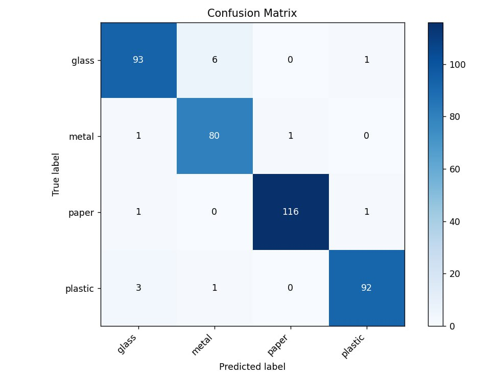

# MR.Clean

An AI-powered system that automatically recognizes and classifies household waste using computer vision.  
The system helps reduce human error in waste disposal and supports eco-friendly recycling.

## 🚀 How to Run and Use

### 1. Clone the repository
```bash
git clone https://github.com/Hayk20082/MR.Clean.git
cd MR.Clean
```
###2. Create virtual environment and install dependencies
```bash
python -m venv venv

# Windows
venv\Scripts\activate

# macOS / Linux
source venv/bin/activate

pip install torch torchvision torchaudio --index-url https://download.pytorch.org/whl/cpu
pip install opencv-python pillow numpy tqdm
```
### 3. Project structure
```bash
MR.Clean/
├── models/           # trained models (.pth)
├── scripts/
│   ├── main.py       # trains the model
│   └── camera.py     # real-time camera inference on PC
├── conf_matrix.jpg
└── README.md
```
### 4. How to use
```bash
python scripts/camera.py
Opens your default webcam
Shows live prediction (Plastic, Glass, Paper, Metal)
Prints class + confidence score every frame
Press Q to quit
```



